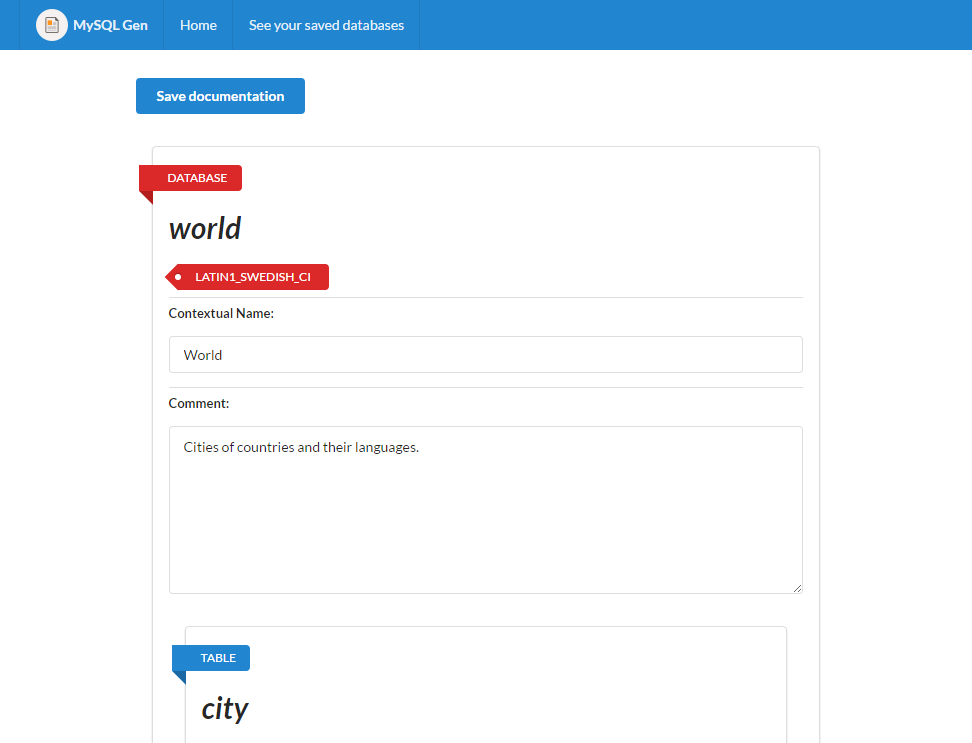
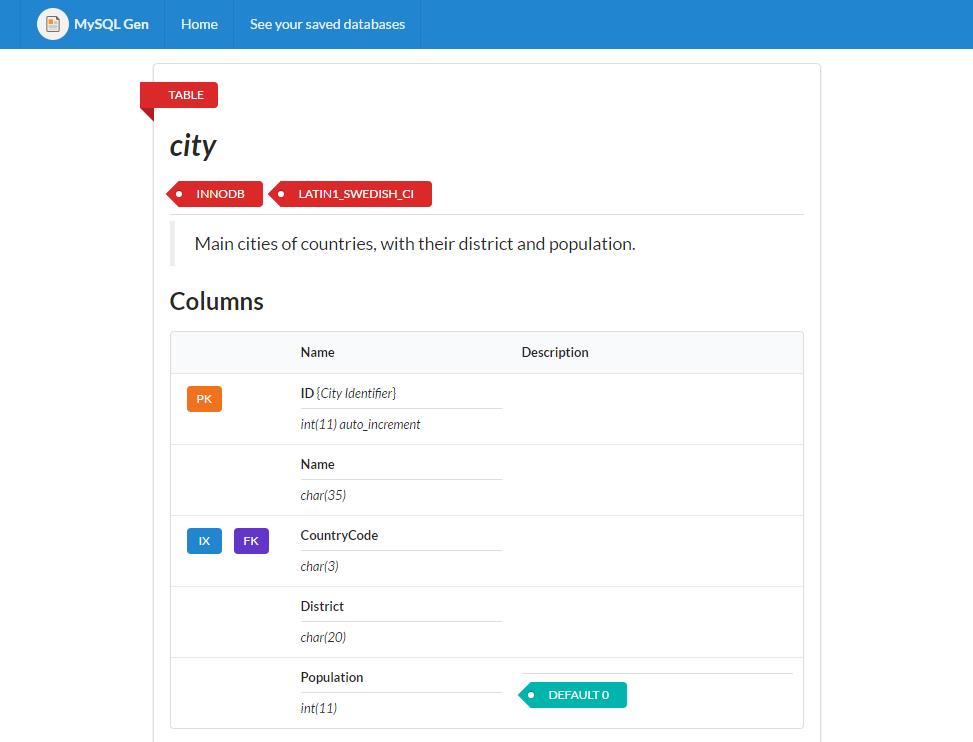

# MySQL-GenDoc
> Document your MySQL databases.

MySQL-GenDoc is a platform developed in PHP to be instaled in a web server. With the platforma it's possible to get your MySQL database schema and be able to write a documentation with: *comments in tables, columns and keys inside the database*.




## Getting Started

### Prerequisites

Some basics recommendations to install the platform and be able to use it.

* PHP 5 or above.
* MySQL 5.6 or above.
* Server with Apache2.
* **ATTENTION**: Don't forget to check configurations in *Configuring the Plataform*.

```
You can use a local server as Vertrigo in Windows machines.
```

### Installing on Server

#### In root folder

```
Put the platform in the root folder, maybe can cause some issues.
```

Put all files that are inside **/public** folder in the root folder on server. Put **/app** folder and **mgd-config.php** file one level above your server root folder. Your files structure will be as below:

* /app
    * (all files and foldes of /app)
* mdg-config.php
* /www (pasta raiz)
    * (all files and foldes of /public)

To access, see *Configuring the Plataform*.

#### In project folder (recommended)

Do the upload of all project files to a new folder **/mysqlgendoc** inside the root folder on server. Your files structure will be as below:

* /www (pasta raiz)
    * mysqlgendoc
        * /app
            * (todos arquivos e pastas de /app)
        * mdg-config.php
        * /public
            * (todos arquivos e pastas de /public)

To access, see *Configuring the Plataform*.

## Configuring the Plataform

To access the platform, you need to do update the constants *UP_PATH* and *HOME_URI* inside **mdg-config.php** file to the right URL to your server.

```
By default will be setted to the *in project folder* model. Update according your needs.
```

### Installed in root folder

```
UP_PATH  -> ABSPATH . "/uploads/";
HOME_URI -> "http://127.0.0.1";
```

### Installed in project folder (default)

```
UP_PATH  -> ABSPATH . "/public/uploads/";
HOME_URI -> "http://127.0.0.1/mysqlgendoc/public";
```

## Languages

### Changing the Language

The MySQL-GenDoc platform has a language system. To set a language, you just need to change the constant *LOCALE*, with the language code, inside **mdg-config.php** file.

```
By default the language will be English (en).
```

#### Available languages

Code | Language
---- | --------
en | English (default)
pt-br | Brazilian Portuguese

### Adding a new Language

To add a new language, copy the default file **/app/locales/en.json** and save it to a new file naming by using a language code ("pt-pt", "en-gb"...), then translate the output data.

**Don't forget to add the new language into this `README` file.**

## Using the Plataform

After installation and configuration, access the URL to the platform. The homepage will show all instructions of how to use.

## Contributing

It is very easy to contribute to this project. Any kind of help is always welcome.

### General Rules 

1. Please, unzip the **-API-documentation.zip** file to read all code documentation.
2. Be aware to the standards in code. 
3. Use the ApiGen patterns to write the code comments.
4. Remember to update this `README` file with all of your modifications.
5. Increase the version number in any files and inside this `README` file.

### How to begin?

1. Do a fork.
    * Do one reference to the original repository.
    * Create a new branch.
2. Undestand the code by reading your documentation.
    * Try to follow the same patterns and use the ApiGen pattern to write the code comments.
3. Write the changes!

```
You can enable the constant *DEBUG* inside **mdg-config.php** file to show PHP errors.
```

4. Do the commit with a objective message.
5. Send a Pull Request, doing a reference to master in original repository.
6. Your contribution will be analysed by community.
    * In some cases, maybe some changes will be requested before do a merge.

### Project Structure

* /app (application)
    * /classes (main classes)
    * /controllers
    * /functions (global classes)
    * /inferfaces
    * /locales (languages files)
    * /models
* /public
    * /css
    * /includes (files to include in views)
    * /js
    * /libs (external libraries in css and js)
    * /uploads (database JSON files)
    * /views (pages)
        * /components (to insert in the pages)
            * /documentation (specific components)

After merge...

1. Delete the branch used.
2. Update your repository with the original repository.

## External Libraries

1. [Semantic-UI](http://semantic-ui.com/), framework to user interface.

## Author

* **Caique M Araujo** - *Initial Version* - [itscaiqueck](https://github.com/itscaiqueck)

## Versions

* 1.0.0 (Caique M Araujo) (2016)
    * Initial Version.

## License

This project is licensed under the GPL v.3. See more details in `LICENSE` file.

## Informations and Comments

(Caique M Araujo) This is my first GitHub project.
